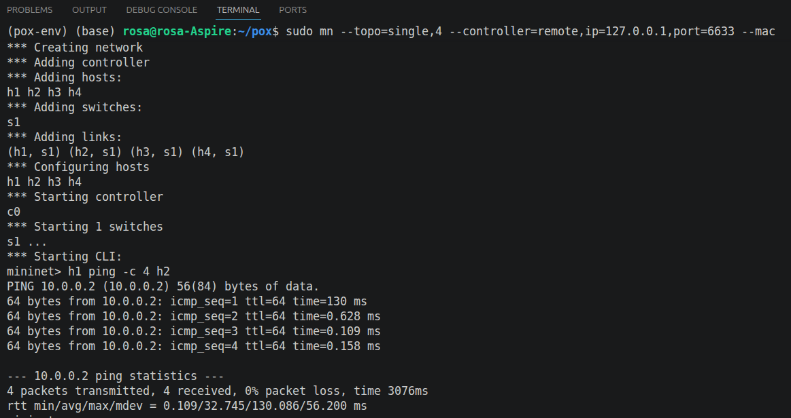
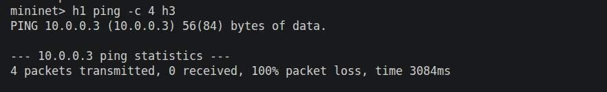
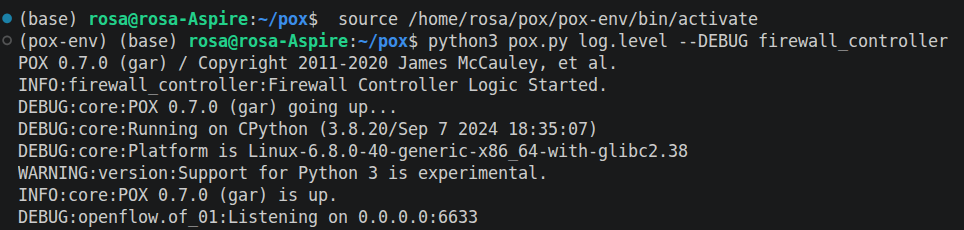
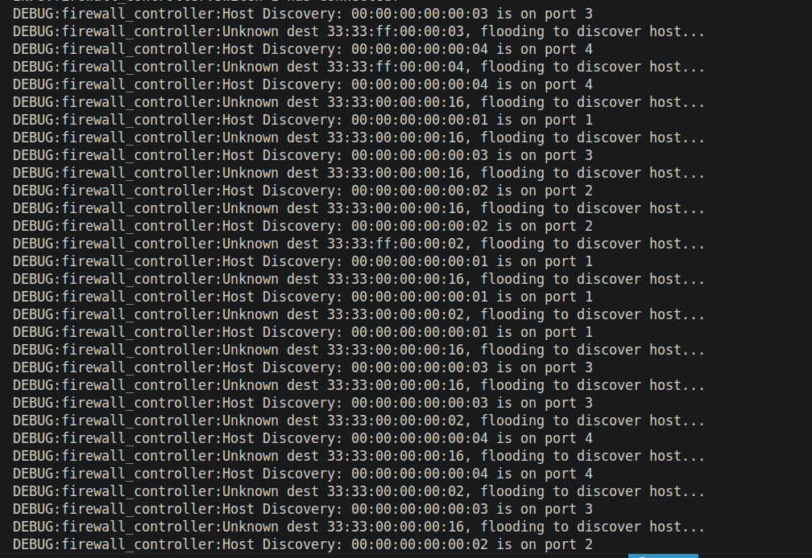
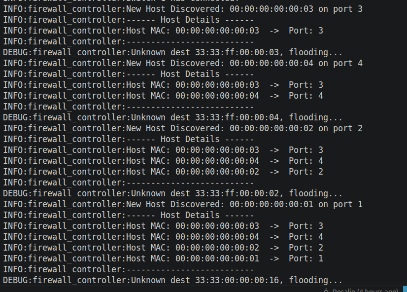
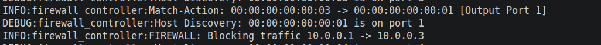
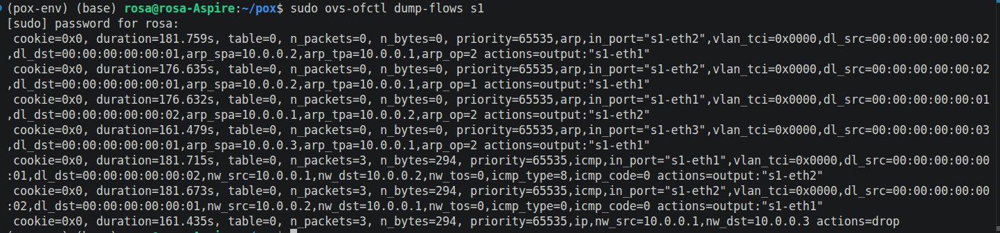
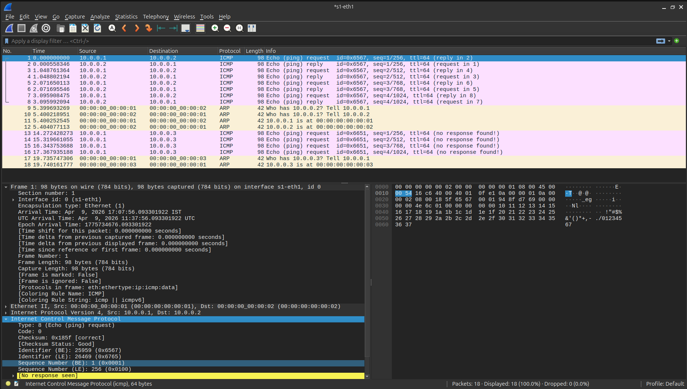

# SDN Host Discovery and Firewall using POX and Mininet

## Overview
This project implements a host discovery service in a Software Defined Networking (SDN) environment using a POX controller and Mininet emulator.

The controller dynamically:
- Detects host join events  
- Maintains a host database (MAC to port mapping)  
- Displays host details in logs  
- Updates host information dynamically  

Additionally, a basic firewall mechanism is implemented to block communication between specific hosts.

---

## Prerequisites

### System Requirements
- Ubuntu 20.04 / 22.04  
- Minimum 4GB RAM  

---

## Required Software

### 1. Python
```bash
python3 --version
```

### 2. Mininet
```bash
sudo apt install mininet -y
```

### 3. POX Controller
```bash
git clone https://github.com/noxrepo/pox.git
```

### 4. Open vSwitch
```bash
sudo apt install openvswitch-switch -y
```

### 5. Wireshark (Optional)
```bash
sudo apt install wireshark -y
```

---

## Project Structure
```
firewall_controller.py  
screenshots_sdn/  
README.md  
```

---

## Setup and Execution

### 1. Start POX Controller
```bash
cd ~/pox
python pox.py log.level --DEBUG openflow.of_01 firewall_controller
```

### 2. Start Mininet
```bash
sudo mn --topo single,3 --controller=remote,ip=127.0.0.1 --switch ovsk,protocols=OpenFlow10
```

---

## Features

- Automatic host discovery  
- Dynamic MAC-to-port mapping  
- Learning switch functionality  
- Firewall rule enforcement  
- Match-Action flow rule installation  
- Dynamic updates based on traffic  

---

## Test Cases

### Allowed Traffic (h1 → h2)
```bash
h1 ping -c 4 h2
```



---

### Blocked Traffic (h1 → h3)
```bash
h1 ping -c 4 h3
```



---

## Controller Output

### Controller Startup


---

### Host Discovery Logs


---

### Show Hosts


---

### Firewall Log Proof


---

## Flow Table

```bash
sudo ovs-ofctl dump-flows s1
```



---

## Packet Analysis (Wireshark)



---

## Expected Results

- Communication between h1 and h2 is successful (0% packet loss)  
- Communication between h1 and h3 is blocked (100% packet loss)  
- Flow rules are installed in the switch  
- Host discovery logs are visible in the controller  

---

## Conclusion

This project demonstrates an SDN-based firewall and learning switch with a host discovery service that dynamically maps MAC addresses to switch ports. It enables efficient packet forwarding, enforces blocked IP policies, and showcases how SDN’s centralized control improves network management and performance.
